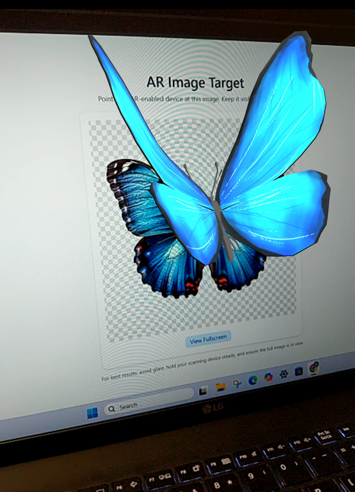
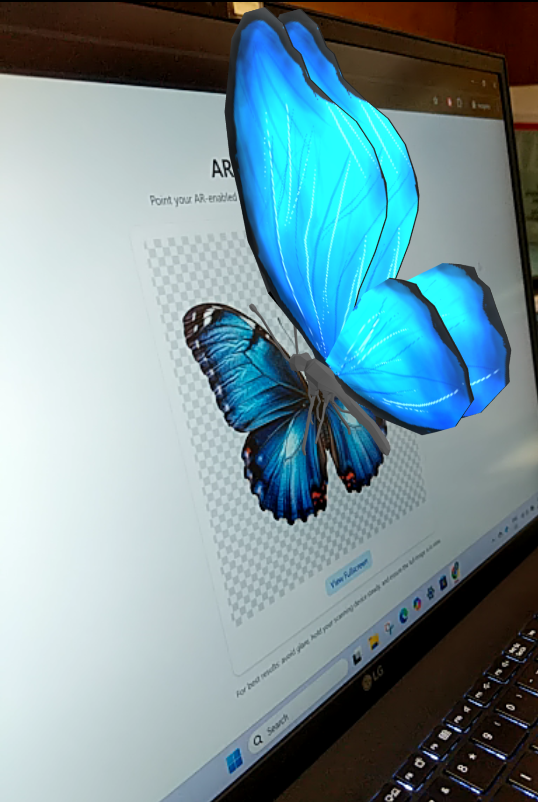

# 🦋 AR Butterfly Experience: Nature Comes Alive Through AR

<p align="center">
  <a href="https://ar-viewer-v1.web.app/">
    
  </a>  
  <a href="https://ar-viewer-v1.web.app/">
    
  </a>
</p>

**AR Butterfly Experience** invites users into a lightweight, web-based augmented reality scene where a vibrant 3D butterfly appears through the camera when scanning a custom image marker. Built entirely with web technologies and deployed on Firebase, this experience is mobile-friendly, installation-free, and visually delightful.

Through the lens of your device, watch a delicate butterfly flutter into your space - rendered with real-time lighting, animation, and immersive marker-based tracking. This project demonstrates the magic of WebAR using React, Three.js, and MindAR.js.

## ✨ Key Features

📸 **Marker-Based AR:** Scan a printed or on-screen image to trigger the butterfly experience  
🦋 **Animated 3D Model:** Butterfly model with smooth, looped animation and realistic movement  
💡 **Real-Time Lighting:** Uses Three.js lighting for lifelike model rendering  
📱 **Mobile-Optimized:** Designed for mobile browsers with simple, intuitive UI  
🧼 **Clean Lifecycle Management:** Properly stops camera stream and renderer on route changes  
🚀 **Firebase Hosted:** Live on a fast and reliable CDN for quick sharing

## 🛠️ Built With

- [React](https://react.dev/) Front-end JavaScript library
- [Vite](https://vite.dev/)
- HTML & CSS (Structure and Styling)
- JavaScript (Interactivity)
- [Tailwind CSS](https://tailwindcss.com/) (Utility-First CSS Framework)
- [MindAR.js](https://hiukim.github.io/mind-ar-js-doc/), by @hiukim Marker-based WebAR framework
- [Three.js](https://threejs.org/) 3D rendering library
- [React Three Fiber](https://r3f.docs.pmnd.rs/getting-started/introduction) React bindings for Three.js
- [@react-three/drei](https://drei.docs.pmnd.rs/getting-started/introduction) Useful abstractions and helpers for Three.js
- [Firebase Hosting](https://firebase.google.com/docs/hosting) Lightning-fast static site hosting

## ⚙️ Getting Started

To get a local copy of this project up and running, follow these steps:

### ✅ Prerequisites

Make sure you have the following installed:

- Node.js
- npm (comes with Node.js)
- Firebase CLI (optional, for deployment)

---

### 📦 Installation

Clone the repository

```bash
git clone https://github.com/dv192/ar-viewer.git
cd ar-viewer
```

Install dependencies

```bash
npm install
```

### 🧪 Usage (Development)

Start the development server

```bash
npm run dev
```

Visit http://localhost:5173 in your browser.

## 🚀 Deployment

This project is deployed on [Firebase](https://firebase.google.com/). Visit the live version [here](https://ar-viewer-v1.web.app/).

To deploy on Firebase Hosting:

Build for production

```bash
npm run build
```

Deploy to Firebase

```bash
firebase deploy
```
